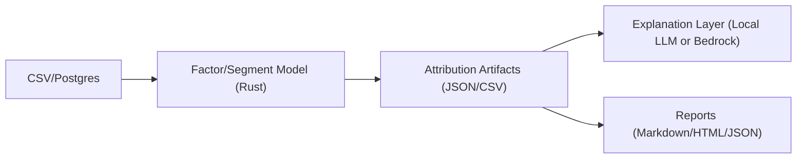

# FactorLens

A Rust CLI for deterministic factor attribution and analytics workflows, with optional AI-generated explanations.

FactorLens explains why metrics change by decomposing results into factor contributions and producing structured analysis artifacts.
FactorLens follows a math-first, AI-second approach: deterministic analytics produce the artifacts, and the LLM layer interprets them.

[](https://github.com/kraftaa/factorlens/releases)
[](https://github.com/kraftaa/factorlens/pkgs/container/factorlens-mcp)

## Quick Example

Given a dataset with sales metrics:

```bash
factorlens analyze --input data/sales_100.csv
factorlens analyze --input data/sales_150.csv
factorlens analyze-compare  --base artifacts/sales_100.json --new artifacts/sales_150.json
# Then generate an executive explanation from the compare artifacts:
factorlens explain-analyze \
  --backend bedrock \  
  --analysis-json artifacts/analysis_compare.json \
  --model anthropic.claude-3-sonnet-20240229-v1:0 \
  --question "What are the main drivers of revenue concentration?"
```

#### Example output  (truncated):

```text
Executive Delta

Top-5 concentration changed from 12.0% → 21.3% (+9.3 pp)
Segment count changed from 62 → 60 (-2)

Top Concentration Changes
1. US | Direct | Premium | 0   9 → 7 records
2. US | Direct | Core | 1      7 → 7 records
3. US | Direct | Core | 0      7 → 7 records
...
```


## Design Principles

FactorLens follows a few simple design rules:

- **Math-first, AI-second** – deterministic factor attribution produces the artifacts, AI only explains them.
- **CLI-first workflows** – designed to run locally, in scripts, or inside pipelines.
- **Structured outputs** – results can be exported as Markdown, JSON, or HTML for humans and automation.
- **Composable commands** – analysis, comparison, and explanation steps can be combined in workflows.

## What It Looks Like

```bash
cargo run -p factor_cli -- analyze \
  --input data/your_file.csv \
  --group-by region,product_line,channel \
  --metrics revenue_usd
```

Default output paths:
- `artifacts/<input_stem>.md`
- `artifacts/<input_stem>.json` (when output format includes JSON)

Example report excerpt:

```text
## Executive Summary

- Largest segment is `US | Core | Direct` with 28.4% of records and 32.1% of total revenue_usd.
- Top 5 segments represent 61.5% of records and 67.9% of revenue_usd.
```

AI layer on top:

```text
Summary:
Growth is concentrated in US direct channel performance, while product-line mix
is creating downside concentration risk in a small number of segments.
```

## Workflow

| Command | Purpose |
|---|---|
| `analyze` | factor/segment attribution from CSV or Postgres |
| `analyze-suggest` | infer likely dimensions/metrics/date and generate starter profile TOML |
| `analyze-compare` | snapshot delta analysis (biggest movers) |
| `explain-analyze` | executive narrative and actions from computed JSON |
| `factors fit` / `factors regress` | statistical factors (PCA) or known-factor regression |

## 2-Minute Quickstart

```bash
# 1) baseline snapshot (100 rows)
factorlens analyze \
  --input data/factorlens_demo_sales_100.csv \
  --group-by region,channel,product_line,plan_tier \
  --metrics revenue_usd,cost_usd,orders \
  --rank-by revenue_usd

# 2) new snapshot (150 rows)
factorlens analyze \
  --input data/factorlens_demo_sales_150.csv \
  --group-by region,channel,product_line,plan_tier \
  --metrics revenue_usd,cost_usd,orders \
  --rank-by revenue_usd

# 3) compare + explain
factorlens analyze-compare \
  --base artifacts/demo_sales_100.json \
  --new artifacts/demo_sales_150.json

factorlens explain-analyze \
  --backend bedrock \
  --model anthropic.claude-3-haiku-20240307-v1:0 \
  --analysis-json artifacts/analysis_compare.json \
  --question "What are the top concentration risks and what 3 actions should we take in the next 30 days?"
```

One-command runner:

```bash
./scripts/demo_sales.sh
# optional Bedrock:
RUN_BEDROCK=1 AWS_REGION=eu-central-1 ./scripts/demo_sales.sh
```

## Demo Data

Public-safe demo files included:

- `data/factorlens_demo_sales_100.csv`
- `data/factorlens_demo_sales_150.csv` (use for compare)

Optional Postgres load:

```bash
psql "$DATABASE_URL" -c "
create schema if not exists demo;
drop table if exists demo.factorlens_demo_sales_100;
drop table if exists demo.factorlens_demo_sales_150;
create table demo.factorlens_demo_sales_100 (
  order_date date,
  region text,
  channel text,
  product_line text,
  plan_tier int,
  revenue_usd numeric(14,2),
  cost_usd numeric(14,2),
  orders int
);
create table demo.factorlens_demo_sales_150 (like demo.factorlens_demo_sales_100);
"
psql "$DATABASE_URL" -c "\copy demo.factorlens_demo_sales_100 from 'data/factorlens_demo_sales_100.csv' with (format csv, header true)"
psql "$DATABASE_URL" -c "\copy demo.factorlens_demo_sales_150 from 'data/factorlens_demo_sales_150.csv' with (format csv, header true)"
```

Generate a starter profile automatically from a new dataset:

```bash
factorlens analyze-suggest \
  --input data/factorlens_demo_sales_150.csv \
  --out artifacts/demo_suggest.md \
  --profile-name demo_exec \
  --auto-group-k 4 \
  --max-metrics 3
```

Large file tip:

```bash
factorlens analyze-suggest \
  --input data/factorlens_demo_sales_150.csv \
  --out artifacts/demo_suggest_random.md \
  --sample-rows 1000 \
  --sample-mode random \
  --sample-seed 42
```

This writes:
- `artifacts/demo_suggest.md` (human summary)
- `artifacts/demo_suggest.json` (machine-readable suggestion report)
- `artifacts/demo_suggest.toml` (ready profile config block)

## Architecture



Math engine first, explanation layer second.

## Why This Exists

Many analytics workflows produce dashboards without a clear explanation of why metrics changed.
FactorLens prioritizes attribution and residual math first, then translates those computed results into business language.

## What This Is Not

- Not a trading bot
- Not a price prediction model
- Not a chat-first analytics toy

FactorLens computes attribution first, then uses LLMs only to explain computed artifacts.

## Integrations

- Local LLMs via `llama.cpp`
- AWS Bedrock
- Claude Desktop / Claude Code via MCP
- CSV and Postgres data sources

## MVP Features

- Price ingestion from CSV
- PCA factor model fitting
- Portfolio factor attribution
- Residual outlier detection
- Artifact outputs (`json` + `csv`)
- Markdown report generation
- Explain command using a local llama.cpp backend (`llama-cli`) with a Bedrock-ready backend contract

## Workspace Layout

- `crates/factor_core`: Returns, PCA, attribution math
- `crates/factor_io`: CSV IO and artifact writing
- `crates/factor_cli`: CLI binary (`factorlens`)
- `crates/llm_local`: `LLMClient` trait + local/bedrock backends
- `crates/report`: Markdown report generation

## Build Instructions

For advanced build/release details, see `BUILD_INSTRUCTIONS.md`.

Quick local build:

```bash
cargo build -p factor_cli
cargo build -p factor_cli --release
```

## Input Formats

`prices.csv`

- `date` (YYYY-MM-DD)
- `ticker`
- `close`

`portfolio.csv` (optional)

- `ticker`
- `weight`

`holdings.csv` (optional alternative to `portfolio.csv`)

- `ticker`
- either `market_value` or both `shares` and `price`

`factors.csv` (for known-factor regression mode)

- `date` (YYYY-MM-DD)
- one or more numeric factor columns (for example: `MKT`, `SMB`, `HML`)

## Quick Start

```bash
cargo run -p factor_cli -- factors fit \
  --prices data/prices.csv \
  --k 3 \
  --out artifacts/ \
  --portfolio data/portfolio.csv

# safer residual analysis: auto-pick k (< number of assets)
cargo run -p factor_cli -- factors fit \
  --prices data/prices.csv \
  --k-auto \
  --out artifacts/ \
  --portfolio data/portfolio.csv

# alternative: derive weights automatically from holdings
cargo run -p factor_cli -- factors fit \
  --prices data/prices.csv \
  --k 3 \
  --out artifacts/ \
  --holdings data/holdings.csv

cargo run -p factor_cli -- report \
  --artifacts artifacts/ \
  --format markdown \
  --out artifacts/report.md

# known-factor regression mode (MKT/SMB/HML-style)
cargo run -p factor_cli -- factors regress \
  --prices data/prices.csv \
  --factors data/factors.csv \
  --out artifacts/ \
  --portfolio data/portfolio.csv

cargo run -p factor_cli -- explain \
  --backend local \
  --model models/llama.gguf \
  --artifacts artifacts/ \
  --question "What drove the largest drawdown?"
```

## Notes

- `explain --backend local` expects `llama-cli` on your PATH.
- `explain --backend bedrock` uses AWS Bedrock via AWS CLI (`aws bedrock-runtime converse`).
- This project is designed for explainability of computed analytics, not market prediction.

## Explainability Notes

- `factors fit` excludes weekend dates by default.
- Pass `--include-weekends` if your dataset intentionally includes weekend trading.
- `explain` supports focused analysis with `--focus-factors`.

Examples:

```bash
cargo run -p factor_cli -- factors fit --prices data/prices.csv --k 3 --out artifacts/ --portfolio data/portfolio.csv
cargo run -p factor_cli -- factors fit --prices data/prices.csv --k 3 --out artifacts/ --portfolio data/portfolio.csv --include-weekends

cargo run -p factor_cli -- explain --backend local --model models/llama_instruct.gguf --artifacts artifacts/ --question "What drove the largest drawdown?" --focus-factors factor_1,factor_2
```

### Custom Factor Names

By default, FactorLens auto-generates factor names from your dataset loadings
(top positive and negative loading tickers per factor), so it works on any dataset.

You can still override labels with a CSV or TSV file via `--factor-labels`.

Example `data/factor_labels.csv`:

```csv
factor,label
factor_1_contrib,Broad Market Beta
factor_2_contrib,Growth vs Value Rotation
factor_3_contrib,Idiosyncratic Spread
```

Use in `explain`:

```bash
cargo run -p factor_cli -- explain --backend local --model models/llama_instruct.gguf --artifacts artifacts/ --question "What drove the largest drawdown?" --factor-labels data/factor_labels.csv
```

Notes:
- Factor keys may be `factor_1`, `factor_1_contrib`, or just `1`.
- `#` comment lines are ignored.

## Suggested Questions

- What was the worst modeled drawdown day, and what factors drove it?
- On the worst day, what percentage came from each factor?
- Which factor is my largest average downside contributor over the full sample?
- Which dates had the biggest positive factor-driven gains?
- Which 5 days had the largest residuals (moves not explained by factors)?
- Did my risk concentration increase in the last month?
- Is my portfolio dominated by one factor or diversified across factors?
- How stable are exposures across time windows?
- Which factor changed direction most often?
- Which factor contributed most to volatility, not just returns?
- If I remove `factor_1`, how much modeled downside is left?
- Compare drawdown drivers with and without weekends included.
- Using only `factor_1,factor_2`, what drove the drawdown?
- Which assets are most aligned with `factor_1` loadings?
- Which assets increased my exposure to downside factors most?

## Generic Table Analysis

Analyze any CSV table by grouping columns and numeric metrics you choose:

```bash
cargo run -p factor_cli -- analyze \
  --input data/your_file.csv \
  --group-by region,product_line,channel \
  --metrics revenue_usd

# profile-based quick starts
cargo run -p factor_cli -- analyze \
  --input data/your_file.csv \
  --profile exec

cargo run -p factor_cli -- analyze \
  --input data/your_file.csv \
  --profile segment

cargo run -p factor_cli -- analyze \
  --input data/your_file.csv \
  --profile supplier

# custom profile config (recommended for private/domain fields)
cargo run -p factor_cli -- analyze \
  --input data/your_file.csv \
  --profile exec_custom \
  --profile-config profiles/profiles.example.toml

# filtered + ranked view
cargo run -p factor_cli -- analyze \
  --input data/your_file.csv \
  --where region=US \
  --rank-by revenue_usd \
  --agg median \
  --percentiles p50,p90 \
  --alert-top5-share 60 \
  --alert-blank-share 10 \
  --top 10 \
  --min-records 20

# text normalization for name/title grouping + JSON-only output
cargo run -p factor_cli -- analyze \
  --input data/your_file.csv \
  --group-by title \
  --metrics revenue_usd \
  --normalize-text-groups \
  --word-freq \
  --output-format html
```

Auto-detect useful grouping columns (if `--group-by` is omitted):

```bash
cargo run -p factor_cli -- analyze \
  --input data/your_file.csv
```

## Analyze Compare

Create two analysis snapshots, then compare them:

```bash
# base snapshot
cargo run -p factor_cli -- analyze \
  --input data/your_file_a.csv \
  --group-by region,channel,product_line \
  --metrics revenue_usd,cost_usd,orders \
  --rank-by revenue_usd

# new snapshot
cargo run -p factor_cli -- analyze \
  --input data/your_file_b.csv \
  --group-by region,channel,product_line \
  --metrics revenue_usd,cost_usd,orders \
  --rank-by revenue_usd

# compare (default: both markdown + json)
cargo run -p factor_cli -- analyze-compare \
  --base artifacts/your_file_a.json \
  --new artifacts/your_file_b.json

# compare (html)
cargo run -p factor_cli -- analyze-compare \
  --base artifacts/your_file_a.json \
  --new artifacts/your_file_b.json \
  --output-format html \
  --out artifacts/compare.html

# compare (json)
cargo run -p factor_cli -- analyze-compare \
  --base artifacts/your_file_a.json \
  --new artifacts/your_file_b.json \
  --output-format json \
  --out artifacts/compare.json

# compare (both markdown + json)
cargo run -p factor_cli -- analyze-compare \
  --base artifacts/your_file_a.json \
  --new artifacts/your_file_b.json \
  --output-format both \
  --out artifacts/compare.md
```

Notes:
- `analyze` defaults to `artifacts/<input_stem>.md` + `.json` (`--output-format both`).
- `analyze-compare` defaults to `artifacts/analysis_compare.md` + `.json` (`--output-format both`).
- `analyze-compare` supports `--output-format md|html|json|both`.
- `--top-movers` controls how many largest movers are shown (default: `10`).

Or analyze directly from Postgres:

```bash
# option 1: inline query
factorlens analyze \
  --postgres-url "$DATABASE_URL" \
  --query "SELECT region, channel, revenue_usd, cost_usd FROM analytics.sales" \
  --postgres-ssl-mode require \
  --postgres-ca-file /path/to/rds-ca-bundle.pem \
  --profile exec_custom \
  --profile-config profiles/profiles.example.toml \
  --out artifacts/analysis.md

# option 2: query file
factorlens analyze \
  --postgres-url "$DATABASE_URL" \
  --query-file sql/sales_analysis.sql \
  --profile exec_custom \
  --profile-config profiles/profiles.example.toml \
  --out artifacts/analysis.md

# option 3: AWS RDS/Aurora TLS with explicit CA bundle (recommended in pods)
mkdir -p /path/to/certs
curl -fL "https://truststore.pki.rds.amazonaws.com/global/global-bundle.pem" \
  -o /path/to/rds-global-bundle.pem

factorlens analyze \
  --query "SELECT * FROM schema.table_a LIMIT 5000" \
  --postgres-ssl-mode require \
  --postgres-ca-file /path/to/rds-global-bundle.pem \
  --profile exec_custom \
  --profile-config profiles/profiles.example.toml \
  --out artifacts/analysis.md
```

Notes:
- Outputs both markdown and JSON (`<out>.json`).
- If `--metrics` is omitted, numeric metrics are auto-detected from the input file.
- `--profile` built-ins (`exec`, `segment`, `supplier`) are generic (no hardcoded domain columns).
- Use `--profile-config <path.toml>` for your own private, file-specific profile mappings.
- Input source is exclusive: use either `--input <csv>` or `--postgres-url` + (`--query` or `--query-file`).
- `--postgres-url` can be omitted if `DATABASE_URL` env var is set.
- `--postgres-ssl-mode` supports `prefer` (default), `require`, or `disable`.
- `--postgres-ca-file` optionally adds PEM CA certificates for DB TLS verification.
- For AWS RDS/Aurora in containers/pods, pass explicit RDS CA bundle via `--postgres-ca-file` if TLS handshake fails with system certs.
- Recommended layout: commit `profiles/profiles.example.toml`, keep private variants as `profiles/*.local.toml` or `profiles/*.private.toml` (gitignored).
- `--where` accepts comma-separated `column=value` filters (AND semantics).
- `--rank-by` ranks groups by a chosen metric (default ranking is by count).
- `--agg` controls metric aggregation: `sum` (default), `mean`, or `median`.
- `--percentiles` adds optional metric columns (`p50`, `p90`) per metric.
- `--count-only` disables numeric metric aggregation and reports concentration using records only.
- `--exclude-blank-groups` drops `(blank)` segment keys before ranking/reporting.
- `--alert-top5-share` and `--alert-blank-share` add threshold-based alerts to report output.
- `--alert-rule` adds custom rules (for example: `top5_record_share_pct>60`, `blank_share_pct>10`, `segments<50`).
  Quote rules containing `<` or `>` in shell commands, for example: `--alert-rule 'segments<50,top5_record_share_pct>60'`.
- `--top` controls how many groups are listed in the report.
- `--top-insights` adds deterministic Top Risks and Top Opportunities bullets to the report.
- `--opportunity-min-records` sets minimum records required for Top Opportunities candidates (default: `2`).
- `--normalize-text-groups` normalizes group values for columns like `name`/`title` (lowercase + punctuation cleanup).
- `--word-freq` adds a Top Words section/counts for `name`/`title`-style grouping columns.
- `--output-format` supports `md`, `json`, `both` (default), or `html`.
- `--min-records` drops tiny segments before ranking (useful to avoid one-record outliers).
- `analyze-suggest --out-profile <path.toml>` writes a ready profile file directly.

Example `--profile-config` file:

```toml
[profiles.exec_custom]
group_by = ["region", "channel"]
metrics = ["revenue_usd"]
rank_by = "revenue_usd"
top = 12
min_records = 20
auto_group_k = 3
```

### pip Package Usage

Install from PyPI:

For packaging/build/publish details, see `BUILD_INSTRUCTIONS.md`.

```bash
pip install --upgrade factorlens==0.1.3
factorlens --help
```

Local model:

```bash
factorlens explain \
  --backend local \
  --model /path/to/model.gguf \
  --artifacts /path/to/artifacts \
  --question "What drove the largest drawdown?"
```

Bedrock:

```bash
export AWS_REGION=us-east-1
factorlens explain \
  --backend bedrock \
  --model anthropic.claude-3-5-sonnet-20240620-v1:0 \
  --artifacts /path/to/artifacts \
  --question "What drove the largest drawdown?"
```

Explain from generic table analysis output (`analysis.json`):

Local model
```bash
factorlens explain-analyze \
  --backend local \
  --model /path/to/model.gguf \
  --analysis-json /path/to/analysis.json \
  --question "What are the top concentration risks and 3 actions?"
```

Bedrock
```bash
factorlens explain-analyze \
  --backend bedrock \
  --model anthropic.claude-3-haiku-20240307-v1:0 \
  --analysis-json /path/to/analysis.json \
  --question "What are the top concentration risks and 3 actions?"
```

### MCP Server (Optional)

If you want to call FactorLens as tools from an MCP client, use:

- `scripts/mcp/factorlens_mcp_server.py`
- `scripts/mcp/README.md`

Quick start:

```bash
pip install mcp
python scripts/mcp/factorlens_mcp_server.py
```

### What Bedrock Step Is Doing

`factorlens explain --backend bedrock` does **not** compute analytics. It only explains
already-computed artifacts.

Step-by-step:

1. You run analytics first (`factors fit` or `analyze`) to produce artifacts.
2. `explain` loads artifact context (for factor mode: `factors.json`, `attribution.csv`, `outliers.csv`).
3. FactorLens builds a constrained prompt from that context.
4. FactorLens calls AWS Bedrock through AWS CLI (`aws bedrock-runtime converse`).
5. Bedrock returns plain-text explanation grounded in the provided artifact context.

Important:
- `analyze` command = pure Rust analytics, no LLM used.
- `explain` command = LLM narrative layer over artifacts.
- For table-analysis markdown (`analysis.md`), you can optionally call Bedrock directly with AWS CLI by passing report text as prompt.
